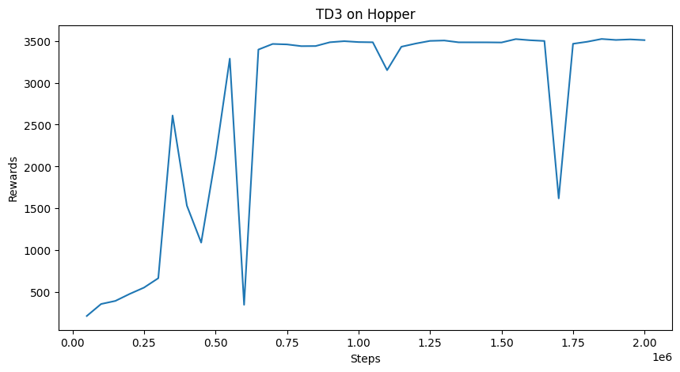
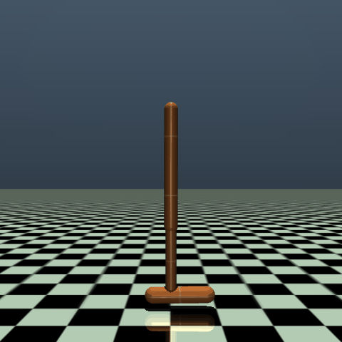
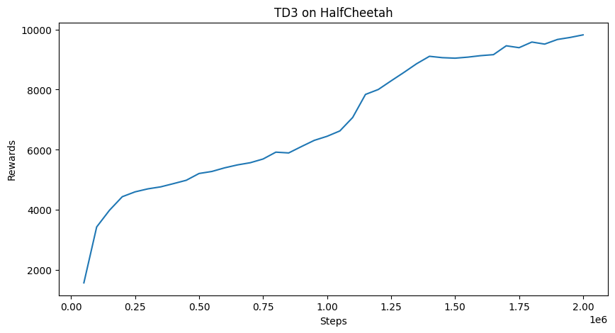
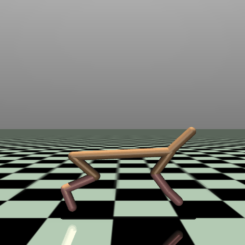
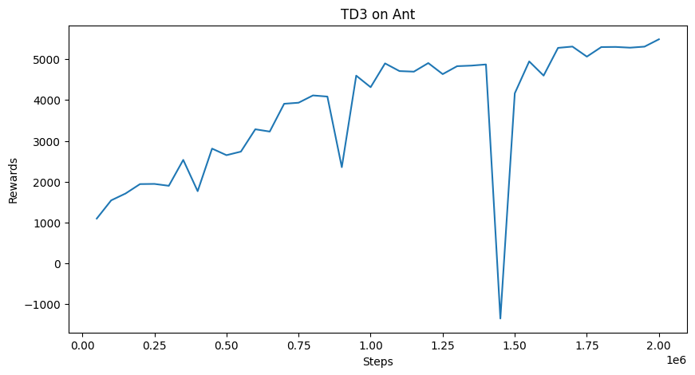
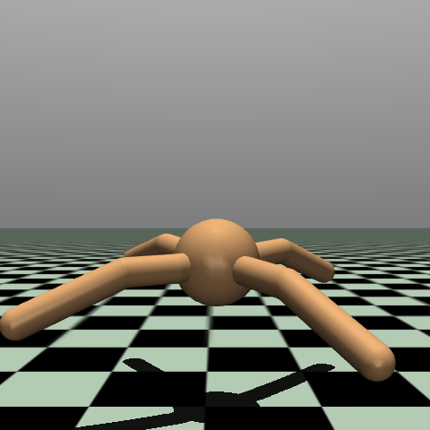

# HIRO-Learning
A personal repository to learn [Data-Efficient Hierarchical Reinforcment Learning](https://arxiv.org/pdf/1805.08296). Model is trained on Gymnasium-Robotics AntMaze_UMazeDense-v5 environment. 

## Algorithm

The Data-Efficient Hierarchical Reinforcment Learning (HIRO) algorithm uses two agents. A higher level agent which observes states and calculates goals and a lower level agent which recieves the states and goals and outputs an action. The algorithm is off-policy with a respective replay buffer for each agent. As per the paper each agent uses the [TD3](https://spinningup.openai.com/en/latest/algorithms/td3.html) algorithm. To enable off-policy training of the higher level agent, selecting from candidate goals the one most likely to have produced the same low-level actions under the current low-level policy.

## Requirements

- Python 3.10

## Installation

### 1. Clone repository
**HTTPS:**
```bash
git clone https://github.com/George-Peregoy/HIRO-Learning.git
cd HIRO-Learning
```

**SSH:**
```bash
git clone git@github.com:George-Peregoy/HIRO-Learning.git
cd HIRO-Learning
```

### 2. Install python dependencies

```bash
pip install -r requirements.txt
```

** Required Packages:**
- gymnasium[mujoco]==1.2.3
- numpy==2.2.6
- torch==2.11.0
- matplotlib==3.10.8
- moviepy==2.2.1
- imageio-ffmpeg==0.6.0
- gymnasium-robotics==1.4.2

## Package structure

```bash
hiro_learning/
├── src/
│   ├── agent.py
│   ├── buffer.py
│   ├── network.py
│   └── utils.py
├── checkpoints/
├── train.py
├── requirements.txt
├── LICENSE
└── README.md
```

### Python Files

- `agent.py` - Stores the lower and higher agents and combines into a singular Agent class.
- `buffer.py` - Defines the replay buffer for the low and high agents.
- `network.py` - Defines the base neural net structure.
- `utils.py` - Holds methods for getting state information such as dim and, bounds, and combining achieved goal with observed state.
- `train.py` - Trains the Agent on the given environment, runs for five million steps and saves agent on best success rate.

## Usage

To train agent run  `python3 train.py`.

## TD3

Since the HIRO agent uses two layers of TD3 agents, the TD3 algorithm was tested separately on [Hopper-v5](https://gymnasium.farama.org/environments/mujoco/hopper/), [HalfCheetah-v5](https://gymnasium.farama.org/environments/mujoco/half_cheetah/), and [Ant-v5](https://gymnasium.farama.org/environments/mujoco/ant/).

### Hopper 

#### Training Curve


#### Result


### HalfCheetah

#### Training Curve


#### Result


### Ant

#### Training Curve


#### Result


## HIRO

### Environment Details

The agent was trained on [AntMaze_UMazeDense-v5](https://robotics.farama.org/envs/maze/ant_maze/). The environment uses a dict for observations with three keys `observation`, `achieved_goal`, and `desired_goal`. By default the environment stores x and y positions in `achieved_goal` the remaining ant state is stored in `observation` (joint angles, velocities, orientation) which must be concatenated together to form the full state used in training.

### Results

The agent was trained for 5 million steps on both sparse and dense AntMaze UMaze environments. The highest observed success rate over a 100-episode window was 0.04. No meaningful convergence was observed. Due to the success of TD3 by itself, the main error must come from the HIRO section however due to the long run time results will be taken as is.